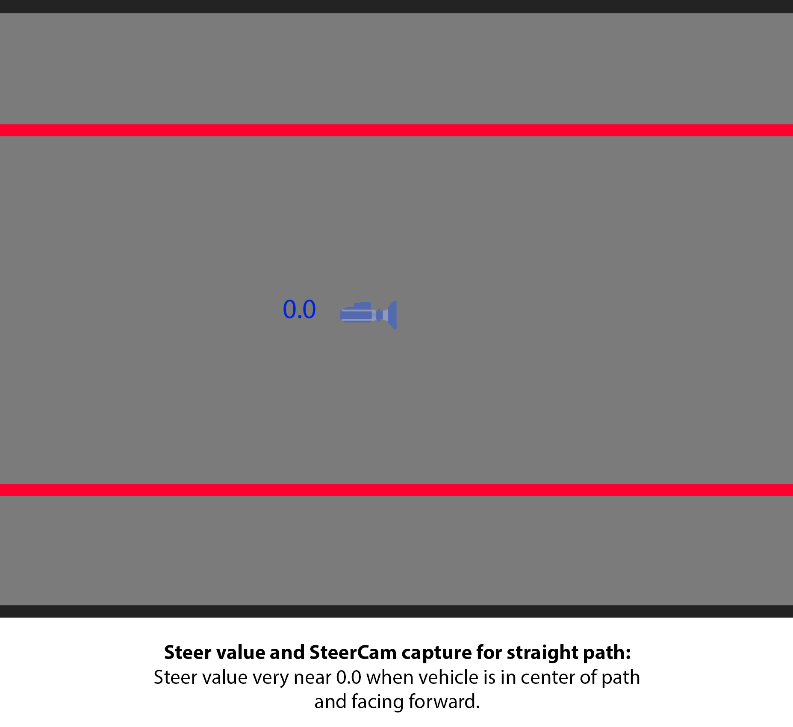
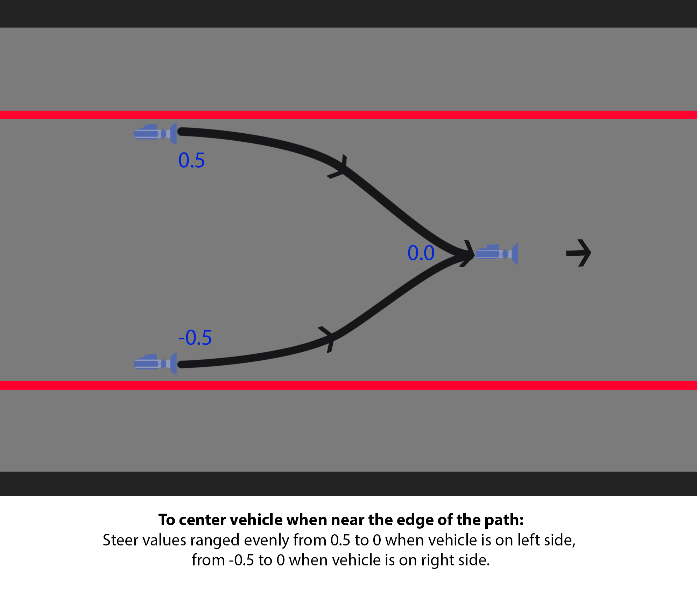

## An experiment in using Unreal 4 to generate datasets for image segmentation and self-steering predictions.

I've been studying deep learning for a few months now. Earlier this year I came across fast.ai. Their approach and philosophy intrigued me and I've enjoyed using their libraries of great Python tools. Lesson 3 of their online course deals with image semgentation and image regression. The lesson mentions how tedious it is to create training data for image segmentation, often requiring a human to create masks and labels for each datapoint by hand.

I come from a video game art background. I've been making 3d digital environments for games for over 20 years, so I thought that I could use my existing skills to devise a method of generating a dataset using a game engine, specifically, Unreal 4, then use the fast.ai libraries and Pytorch to train a neural network that would predict the image segmentation of a camera shot taken from a 3D environment in the game engine. For further practice, I would then use those segmented images and steering data captured from the game engine as the training data for another neural network that would make steering predictions to keep a moving vehicle on a simple path.

# Requirements

- Python 3.7+
- NumPy
- Pandas
- Pyperclip
- fastai 1.0.47

# Descriptions of contents

- SteeringValuesProcessing.ipynb - jupyter notebook containing cells intended to be run individually as needed. These helped with the data management of steering values captured from Unreal, processing screenshots for size, name, and format needed for NN training.

- steerPred_imageSegUE4.ipynb - juyter notebook that uses transfer learning from resnet34, data collected from Unreal and the SteeringValueProcessing notebook to train a Unet neural network to make image segmentation predictions.

- steerPred_steerPredict.ipynb - notebook that uses transfer learning from resnet34, data generated from Unreal and the SteeringValueProcessing notebook to train a convoluted neural network to make steering predictions for a vehicle traveling along a path.

- startPredictors.py - script that runs in the background that makes steering predictions based on camera output in Unreal 4.

- Not included in this repository: 
  - the images and labels used to create the dataset
  - the pickle file that contains the unet and CNN
  - the Unreal project
  
  These are too large for a git repository, but I'd be happy to share them via Dropbox if anyone is interested.

# Generating a dataset for image segmentation

In Unreal I created a simple path that winds through a little village. The path is clear, mostly uniform, gently curving, with no forks or intersections. I then created a camera with very simple controls: it always moves forward at a constant speed and steering is controlled through user input (keyoard or game controller). At every frame I recorded the steering value coming from the user into an array. After completion the array is dumped to a text file, which I process in the SteeringValuesProcessing notebook into a csv, which Unreal can read in. So, esentially what I've done is record the path of the camera. When I read that csv back into an array in Unreal, a Blueprint will step through one value every frame, then feed that into the steering input, and thus the camera will follow the exact same path as I initially drove, as long as the intial start position and orientation remain constant. I then captured a screenshot at every frame while the camera followed the path. These screenshots comprise the images of the dataset. To create the labels I duplicated the 3D environment, replaced all the materials with flat, unlit, brightly-colored materials that correspond to the different classes I want to predict; i.e road, grass, fence, house, sky, etc. Using the same camera moving along the previously-recorded path, I then took screenshots at every frame. The result is a perfectly aligned label, generated in seconds.

<b>Image</b>   

<b>Label</b>   

I then had to do a lot of image processing on the label images to get them into a format similar to the dataset I was emulating: http://mi.eng.cam.ac.uk/research/projects/VideoRec/CamVid/. This entailed converting the colors to gray values that correspond to a predetermined code. For example, the code for 'house' was 8, so my processing converts all the red pixels (the 'house' pixels) in the label into a dark gray (red 8, green 8, blue 8). The code for 'road' was 3, so my processing converts all the dark blue pixels (the 'road' pixels) in the label into a darker gray (red 3, green 3, blue 3). And so on for each of the codes. This was done in the SteeringValuesProcessing notebook.

# Making image segmentation predictions

The steerPred_imageSegUE4 notebook goes through my process of training a Unet. In short, I was able to correctly classify around 95% of the pixels accurately. I thought it was pretty awesome that the unet was so good at figuring out what it was looking at.

 
<b>Left Column: Dataset images overlayed with labels. Right Column: Same dataset images overlayed with predictions.</b>

# Generating a dataset for steering prediction (regression)

Because the labels for the image segmentation are so dark, I multiplied each value by (255/num of classes) so the grayscale image uses up the entire spectrum. It was then a lot easier to see the masks and evaluate predictions. For the targets of the image regression I used the steering values I captured while making the image segmentation dataset. 

# Making steering predictions

The steerPred_steerPredict notebook shows my process of training the CNN. I was never able to get very good loss. It always minimized at  around 0.05, which is not very good for steering values that ranged from -1.0 to 1.0. I pressed on ahead anyway to see how it would perform in the game engine. Later, I found out that this approach had some major flaws, so the current version of this notebook reflects a lot of changes I made later to the dataset. See th <b>What Went Wrong</b> section below.

# Unreal and predictors setup

I created the startPredictors.py script to take the output of a camera in Unreal, feed that through the image segmentation predictor, then process that prediction and feed it to the steering predictor, which would then in turn feed its prediction back to Unreal. This needs to be started first and be running in the background before anything in Unreal executes. The vehicle (traveling forward at a constant speed, to simplify my life) updates its steering values based on the predictions. For the Unreal setup I used a really simple Blueprint that acts on the vehicle (download to see full size):

 
</h2>

 
</h2>

For the 2d image capture and clipboard copy functionality I had to use this plugin: https://forums.unrealengine.com/development-discussion/blueprint-visual-scripting/4014-39-rama-s-extra-blueprint-nodes-for-you-as-a-plugin-no-c-required.

# What went wrong:-/

This approach failed. First off, and most obviously, the image segmentation prediction was too slow. It was taking well over one second, which is not enough updates to keep the vehicle on the path, even at very slow speeds. Secondly, my steering predictor was too innacurate. Even after predicting the image segmentation the steering prediction was so bad that it was pretty much entirely useless. I had to go back and rethink my approach.

## New Approach

I decided to abandon image segmentation. I don't know enough about how to make it fast enough for my needs. So instead I decided to see what I could learn by focusing on the simplest problem: keeping the vehicle on an entirely straight path. In Unreal I created a flat-shaded gray path with bright red lane markings on both sides. My goal was to keep the vehicle between the red lane markers.

I also set my mind to the problem of why my steering predictions were so bad. All of my experimenting and parameter tuning had done nothing to improve it. I reasoned that it must be my training data that was the culprit. It eventually dawned on me that I was providing contradictory training data to the model. In my effort to provide data that reflected all the situations the vehicle might find itself in, I was inadvertantly providing it with misleading and confusing data. For example, I wanted to provide data for what the vehicle should do when it finds itself near the outer edge of the path, so I steered over to the shoulder, then steered back toward the center. I captured the screenshots and steering data for this entire sequence, but actually the initial part of this sequence is not the kind of driving behavior I want my vehicle to emulate. When the vehicle is moving directly down the center of the road I don't want it to wildly steer to the shoulder. I want it to continue in the center of the road and make only small steering corrections as needed to keep it there. I realized I would have to be more careful about how I generated my dataset.

 
</h2>

So I started anew with creating a dataset for the steering predictions. I captured frames of the vehicle at the center of the path, looking directly forward down the path. In the labels csv I assigned steer values of numbers very close to 0.0.

 
</h2>

I then turned the vehicle about 80 degrees to the left while still placed in the center of the path. I then captured screenshots while turning to the right (1.0 steering value), and assigned labels evenly spaced from 1.0 to 0, thus telling the vehicle to turn sharply to the right whenever it found itself in the center of the path but turned toward the lane markings, and do minor corrections when nearly looking forward but still looking left of center. I then repeated this with the vehicle turned 80 degrees to the right, and assigned it labels evenly arranged from -1 to 0.

 
</h2>

For cases where the vehicle found itself near a lane marking, either to the left or right side of the path, and looking straight down the path, I captured screenshots as I gently maneuvered back toward center and aligned it to look directly forward down the path. I assigned these labels ranged evenly from 0.5 to 0 and -0.5 to 0 respectively, telling the vehicle to move gradually from the edge of the path to the center and keep it aligned to move down the path.

 
</h2>

With this more carefully created dataset I then trained the CNN using the steerPred_steerPredict notebook. With this data I was able to get much better losses, eventually ending up around .005, a major improvement. For some reason that I don't really understand, I wasn't able to get my training loss to be less than my validation loss, as I was advised to in the fast.ai course (suggesting underfitting), but the results looked good and my predictor was giving me steering values really close to my labels. Later, I realized using resnet34 for transfer learning was probably overkill for this problem. I wasn't trying to really recognize anything but line angles and a simpler architecture would be more efficient.

Using the same setup for Unreal as described above, I finally got my vehicle to stay between the red lines. I implemented a control override that allows the user to nudge the vehicle either left of right, to test it's abilitiy to correct its steering and stay on course.

Admittedly, and by design, this was a very simple case. I figured the next step was to add some gentle curves to the path and see how it handled those. I had assumed, from the beginning, that I would have to expand my dataset to include data that would teach the CNN to navigate curves, but as I started to think of approaches to do this, I thought why not just make a curve and see how it handles it without adding any new data? Amazingly, the vehicle was able to navigate a gentle curve with no new training. I find it fascinating and exciting that it was able to generalize that training well enought that it didn't need new training data to tell it how to handle a path that wasn't totally straight.

 
</h2>

As I built my path longer and it began to bend back toward itself I found that the predictor would get confused sometimes and drive off the road when its steerCam could see other parts of the path. I was able to solve this problem by reducing the steerCam's vision range. I shrunk its capture aspect ratio and angled it down slightly so it was looking more at the path directly in front of it and not all the way to the horizon. This not only reduced my training and prediction times, but also made a vehicle that stayed on the path better, regardless what was further up along the road or at its periphery.

 
  <b>SteerCam's output cropped, with steer value targets above each pic.</b>
</h2>

# Steer predictor in action

 
  <b>Running in the Unreal editor. White numbers represent the incoming steer predictions.
  I'm skipping a lot of frames here to keep the file small. It's not actually traveling this fast.
  Notice at one point I try to nudge the vehicle off course (steer value goes to -1.0), but it's able to recover.:)</b>
</h2>

# Future plans for this project: 

- Implement image segmentation. It will require creating a much faster predictor. I'll probably have to create a custom architecture rather than using resnet34, or figure out some other techniques. I'm pretty new to all this, so any advice or ideas are encouraged.
- Implement speed predictor. Currently the vehicle travels at a constant speed. I already have added some user control that allows adjustment of the speed multiplier on the fly, so the user can experiment with how fast the vehicle can travel before flying off the path.
- Add data for when the vehicle is on the shoulder of the path. Currently if the vehicle passes over the red lane markers it doesn't know how to get back onto the road.
- Intersections. It will be a challenge to train the vehicle to handle intersections. I haven't yet thought about what it will entail entirely.

# Final Thoughts

It's been a great learning project for me. I'm not an exerienced coder, so it's been challenging to have to figure out a lot of new Python functionality, but I'm really excited about combining these new skills and my past experience in 3D game engines to create datasets and test new machine learning ideas.

